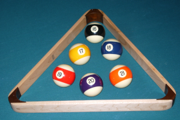
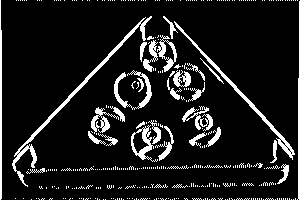
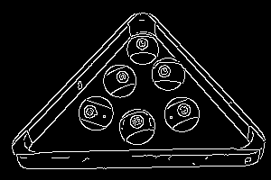
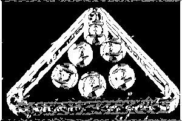
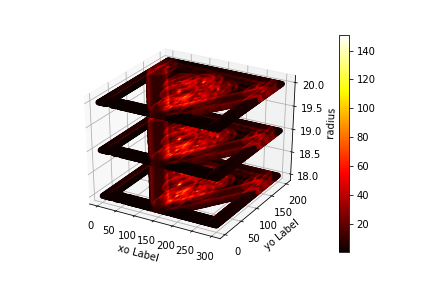

# Hough Transform for circle detection 

### First we implemented Canny edge detection for the following input image

#### for canny edge detection with TH=940 and TL=1200 this thresholds have been chosen as the magnitude of sobel is in range 600 to 3000 
###### [[1493    0    0 ... 1497    0 1195]
###### [1708  931    0 ...    0  743 1371]
###### [1892  776  359 ...  278  607 1522]
###### ...
###### [3409 1363  592 ...  560 1296 3198]
###### [3100 1625    0 ...    0 1560 2903]
###### [2735    0    0 ... 3205    0 2547]]
###### [[1493    0    0 ... 1497    0 1195]
###### [1708  931    0 ...    0  743 1371]
###### [1892  776  359 ...  278  607 1522]
###### ...
###### [3409 1363  592 ...  560 1296 3198]
###### [3100 1625    0 ...    0 1560 2903]
###### [2735    0    0 ... 3205    0 2547]]

#### Top After compaing with python opencv canny edge detectio with TL=100 and TH=200
#### Bottom After compaing with python opencv canny edge detectio with TL=100 and TH=200
   
#### so we choosed TL=940  and TH=1200

### For circle detection implementation
$$Xo=X-r*Cos(theta)$$
$$Yo=Y-r*Sin(theta)$$
###### for Xo,Yo are the coordinates of the centre of the circle and r is the radius

###### we choosed r in range from 18 to 20 , theta in range (0,360) with step1  
###### and for decreasing the calculations we calculated $r*Cos(theta)$ and $r*Sin(theta)$ for all ranges of r and theta and stored them in a list

 for r in range(rmin,rmax+1):
    for t in range(180):
        points.append((r,int(r*cos(2*pi*t/180)),int(r*sin(2*pi*t/180))))
then for each edge we calculated 
$$Xo=X-r*Cos(theta)$$
$$Yo=Y-r*Sin(theta)$$

for x in range (slicecanny.shape[1]):
    for y in range(slicecanny.shape[0]):
        if(slicecanny.item(y,x) !=0):
            for r,dx,dy in points:
                xo=x-dx
                yo=y-dy
                if(xo>=0 and xo<=xmax and yo>=0 and yo<=ymax):
                    acc[(xo,yo,r)]+=1
then we put the output in dicthere is acc after counting the number of pixels for the same xo, yo and r and we applied that by using dict from collections in python as we want something like hashtable or hashmap.

we put threshold 85 for number of pixels which are taken to decide whether it is a circle, also  we excluded circles that are too close of each other (here, once a circle has been selected, we reject all the circles whose center is inside that circle).
for k,v in sorted(acc.items()):
    x, y, r = k
    if(v/100 >=0.85 and all((x - xc) ** 2 + (y - yc) ** 2 > r ** 2 for xc, yc, rc in circles)  ):
        circles.append((x,y,r))
        
Excluding circles close to each other inspired by https://www.codingame.com/playgrounds/38470/how-to-detect-circles-in-images

#### and here is the output

#### for plotting hough transform we needed 4D plot so we used a 3D plot between Xo,Yo and r with number of pixels on the spectrum on the right hand

